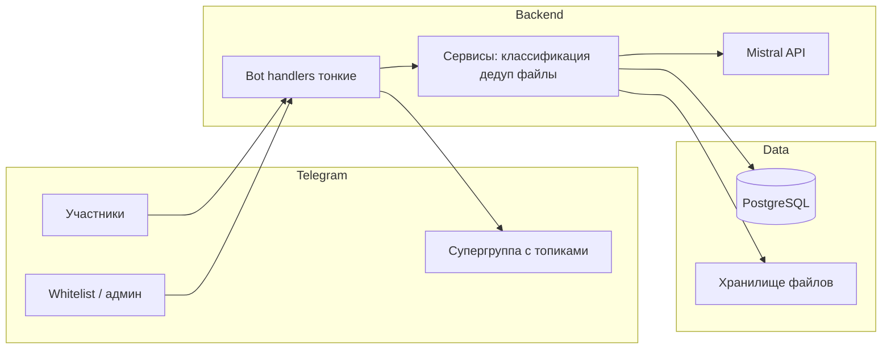

# План: Telegram-бот для сбора данных в общую БД

## Контекст и границы MVP

Соответствует идее из [документа в Downloads](file:///Users/shallbe/Downloads/%D0%B8%D0%B4%D0%B5%D1%8F/%D0%BC%D0%BD%D0%B5%20%D1%82%D1%83%D1%82%20%D0%BF%D1%80%D0%B8%D1%88%D0%BB%D0%B0%20%D0%B8%D0%B4%D0%B5%D1%8F%20%D1%81%D0%BE%D0%B7%D0%B4%D0%B0%D1%82%D1%8C%20%D0%B3%D1%80%D1%83%D0%BF%D0%BF%D1%83%20%D1%81%20%D0%BC%D0%BE%D0%B8%D0%BC%D0%B8%20%D0%B7%D0%BD%D0%B0%D0%BA%D0%BE%D0%BC%D1%8B%D0%BC%D0%B8%20%D0%B8%20%D0%B4%D1%80%D1%83%D0%B7%D1%8C%D1%8F%D0%BC%D0%B8%2C%20%D0%B2%E2%80%A6.md): сначала **система сбора и структуры**, не «всё сразу». Сайт, хакатоны, мок-собесы — **вне** этого плана.

**Важно:** хранение и распространение «сливов» курсов несёт юридические риски; в продуктовой логике лучше позиционировать файлы как **собственные конспекты / разрешённые материалы / коллективные закупки**, а не пиратский контент.

**Безопасность:** в [links.txt](file:///Users/shallbe/Desktop/Closed_hub/links.txt) лежат токен бота и ключ Mistral. Перед разработкой: вынести в переменные окружения, добавить `links.txt` в `.gitignore` (или удалить секреты из файла), при утечке в git — **создать новый токен у @BotFather и новый API-ключ**.

---

## Целевая архитектура (MVP)

- **Стек:** Python 3.11+, **python-telegram-bot** v21+ (или **aiogram** 3.x — на выбор; в плане ниже заложены общие шаги). **PostgreSQL** через `asyncpg` или SQLAlchemy 2 async — по правилам проекта запросы должны оставаться читаемыми, без лишней ORM-магии.
- **Конфигурация:** `.env` + `pydantic-settings`; промпты — **отдельные файлы** (например `prompts/*.txt`), вызовы LLM — **отдельные функции**; в handlers только приём → вызов сервиса → ответ (правило из ваших core rules).

---

## Этап 0: Инфраструктура и Telegram

1. **Супергруппа с топиками** (forum): создать темы под мероприятия (и при необходимости черновики под другие типы). Записать **числовые `message_thread_id`** для каждой темы — их нужно хардкодить в конфиге или хранить в таблице `telegram_topics`.
2. **Бот в группе:** права на отправку сообщений в нужные топики; для пересылки/публикации из бота — методы `copy_message` / `send_message` с `message_thread_id`.
3. **Режим приватности:** бот работает в **личке** с пользователями (удобнее для файлов и длинного контекста); публикация — в группу от имени бота.

---

## Этап 1: Модель доступа (белый список и «добавь»)

**Сущности в БД (минимум):**

- `members` — `telegram_user_id`, статус (`pending` / `active` / `revoked`), кто пригласил, `created_at`.
- `whitelist_users` — пользователи, которым разрешено **приглашать** (начальный список + выдача через env/первый запуск).
- Опционально: `invite_tokens` если позже понадобятся одноразовые ссылки.

**Поток:**

1. Пользователь **не** может пользоваться ботом, пока для его `user_id` нет записи `active` в `members`.
2. Участник из `whitelist_users` отправляет в личку боту, например:  
   `123456789 добавь` или кнопка меню «Добавить участника» → бот просит **переслать сообщение** от нового человека или ввести UID (пересылка надёжнее — Telegram отдаёт реальный `forward_from.id`).
3. Бот создаёт/активирует `members`, пишет подтверждение пригласившему и короткое приветствие новому пользователю (если тот уже нажал Start).

**Меню:** `ReplyKeyboard` или `InlineKeyboard` с действиями: «Добавить участника», «Справка» (только для whitelist); обычным — «Что я могу отправить».

---

## Этап 2: Общий пайплайн сообщений (маршрутизация)

**Идея:** не гонять каждое сообщение в тяжёлый LLM без нужды.

1. **Эвристики (дешево):** документ / фото / `document.mime_type == pdf` → ветка «файл»; текст, похожий на одиночный числовой Telegram ID (regex) → ветка «кандидат HR uid»; пересланное сообщение с датой/названием события → кандидат «мероприятие».
2. **LLM-классификатор (Mistral):** короткий JSON-ответ: `intent`: `event` | `hr_contact` | `file_material` | `other`, плюс уверенность. Использовать **дешёвую модель** для маршрутизации, отдельный промпт в файле.
3. Логирование всех входящих сообщений в `inbound_messages` (текст, `file_id`, `from_user_id`, `date`) — **это основа «рекурсивного» контекста**, т.к. Bot API не даёт историю чата задним числом.

---

## Этап 3: Тип 1 — Мероприятия

**Логика:**

1. Нормализовать текст (текст пересланного сообщения + подпись).
2. **Дедуп:** поиск в PostgreSQL по полям: нормализованное название, дата(ы), URL; опционально **embedding** или fuzzy-поиск позже; на MVP — LLM: «совпадает ли с одним из N последних событий» + простой SQL `ILIKE` по ключевым словам.
3. Если новое — вставка в `events` (сырой текст, источник, статус модерации если нужен).
4. **Публикация в группу:** `copy_message` из лички в топик «мероприятия» **или** `send_message` с кратким форматированным резюме + ссылка; технически проще и сохраняет авторство — `copy_message` от пользователя бот не может «от имени», поэтому обычно шлют **текст/копию через бота** с пометкой источника.

**Уточнение на будущее:** нужна ли ручная кнопка «Опубликовать» у админа — заложить флаг `publish_pending`.

---

## Этап 4: Тип 2 — Контакты HR (UID + контекст батчами)

**Поведение:**

1. Сообщение только с UID → создать/обновить черновик `hr_contacts` (`telegram_uid`, статус `awaiting_context`).
2. Следующие сообщения от того же пользователя **в течение окна** (например 30–60 минут или пока не закрыто командой «готово») добавляются в `hr_contact_notes` или в JSON-массив, и триггерят **батчевую** обработку: накопить 3–5 коротких реплик или N минут тишины — вызвать Mistral с системным промптом «извлеки: компания, роль HR, для каких вакансий, комментарий».
3. «Рекурсия» = чтение **последних K записей** из `inbound_messages` для этого `user_id`, а не рекурсия по Telegram API.

**Вывод пользователю:** краткое резюме + «Верно?» (`InlineKeyboard` Да / Нет / Редактировать). После подтверждения — статус `confirmed`.

**Приватность:** в БД не хранить лишнее; доступ к просмотру контактов на MVP — только активные `members` (выдача через бот-команды или позже через сайт).

---

## Этап 5: Тип 3 — Файлы (PDF и др.)

1. **Скачивание:** `get_file` + сохранение в **локальный каталог** (MVP) или **S3-совместимое** хранилище (production). В БД: `files` — `storage_path` или ключ объекта, `sha256`, `mime`, `uploaded_by`, `created_at`.
2. **Извлечение текста:** библиотека **pypdf** / **pdfplumber** для простого текста; если качество плохое — **Mistral OCR / document API** (у вас в заметках есть ссылка на PDF API — проверить актуальный endpoint Mistral для загрузки документов и лимиты).
3. LLM: краткое описание + предлагаемая категория (курс / контест / конспект / другое).
4. **Human-in-the-loop:** сообщение «Мы отнесли к X. Верно?» + кнопки; при несогласии — свободный текст или выбор из списка категорий из конфига.

---

## Этап 6: Наблюдаемость и стоимость

- Логирование запросов к Mistral: токены/латентность (хотя бы в таблицу `llm_calls` или structlog).
- Лимиты: rate limit на пользователя, макс. размер PDF, таймауты.
- Fallback: при падении Mistral — сохранить сырьё в БД и ответить «обработаем позже».

---

## Этап 7: Деплой

- Docker Compose: `app` + `postgres` (+ опционально `nginx` позже).
- Один процесс **long polling** на MVP (проще); для прод — webhook + HTTPS.
- Миграции: **Alembic** или простой порядок SQL-файлов — на ваш вкус, главное воспроизводимость.

---

## Структура репозитория (минимум папок, по вашим правилам)

Предлагаемый скелет в [Closed_hub](file:///Users/shallbe/Desktop/Closed_hub):

- `bot/` — `main.py`, `handlers/` (только wiring), `keyboards.py`
- `services/` — `onboarding.py`, `events.py`, `hr_contacts.py`, `files.py`, `llm.py`
- `db/` — пул подключений, репозитории с чистым SQL
- `prompts/` — тексты для Mistral
- `config.py`, `docker-compose.yml`, `requirements.txt`

После каждого содержательного изменения — файл **`change_N.md`** (кратко: что / зачем / почему так / что улучшить), как в ваших project rules.

---

## Риски и открытые решения

| Риск | Митигация |
|------|-----------|
| Нет истории в Telegram | Своя таблица `inbound_messages` |
| Дедуп мероприятий | SQL + LLM; позже embeddings |
| Стоимость LLM | Эвристики + дешёвая модель для classify |
| Юридически чувствительный контент | Не поощрять пиратство; модерация |

**Нужно от вас до реализации (можно зафиксировать в конфиге):** точные названия топиков и их `message_thread_id`, список категорий для файлов, таймаут окна для HR-контекста.

---

## Порядок работ (итерации)

1. Секреты → `.env`, скелет проекта, Docker Postgres, миграции `members` + `whitelist_users`.
2. Команды `/start`, whitelist-поток «добавь» + меню.
3. Логирование входящих в `inbound_messages`.
4. Маршрутизация (эвристика + Mistral classify).
5. Мероприятия: таблица `events`, публикация в топик.
6. HR: черновики + батчи + подтверждение.
7. Файлы: загрузка, парс PDF, уточнение категории, путь хранения.
8. Полировка: ошибки, лимиты, `change_N.md`.
