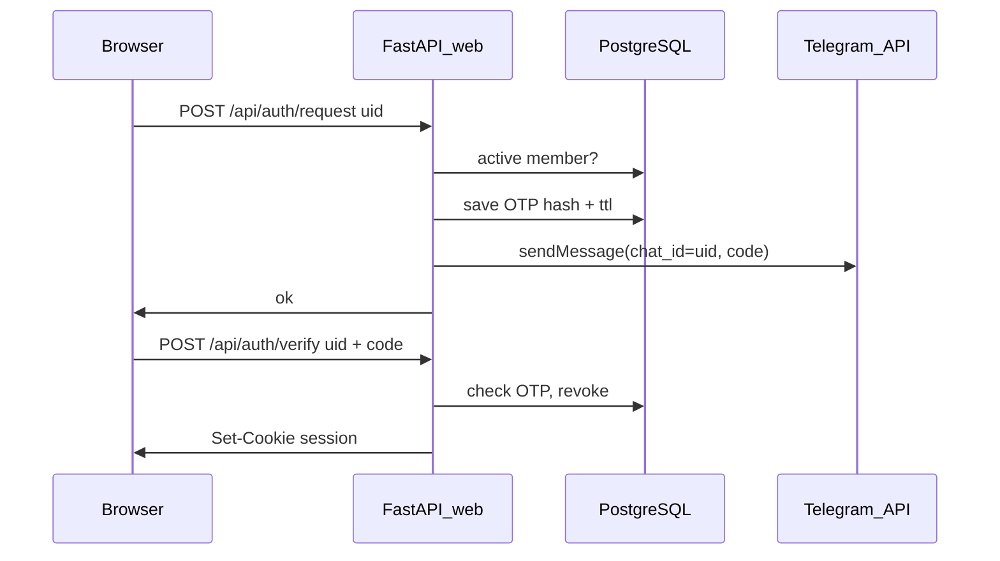

# План: сайт-хаб (тёмный минимализм) + вход через бота

## Контекст из репозитория

- Стек сейчас: Python 3.11+, [pyproject.toml](pyproject.toml) — только бот (`python-telegram-bot`, `asyncpg`), без веб-фреймворка.
- Файлы библиотеки: таблица `files` (`status = 'confirmed'`), пути на диске через [services/file_storage.py](services/file_storage.py) (`storage/library/{slug}/…`), список в [db/repo.py](db/repo.py) `list_library_files`.
- Мероприятия: таблица `events` ([db/schema.sql](db/schema.sql)) — `raw_text`, `normalized_title`, `created_at`, `status`; публикация в [services/events_service.py](services/events_service.py).
- Участники: `members.telegram_user_id`, `status` (`active` / …) — проверка доступа как у бота.
- Миграции на живых БД: патчи в [db/schema_patch.py](db/schema_patch.py) (следующий id **5**).

## Архитектура

- **Отдельный процесс** веба (как и бот): тот же образ/зависимости, второй `CMD` / сервис в [docker-compose.yml](docker-compose.yml), общий volume `./storage` и `DATABASE_URL`.
- **Отправка кода**: HTTP `sendMessage` тем же `telegram_bot_token` (личный чат: `chat_id` = числовой user id). Если пользователь ни разу не открывал бота — Telegram вернёт ошибку; на фронте показать понятное сообщение («сначала /start в боте»).

## Данные и миграции (patch 5 + при необходимости правка `schema.sql` для новых установок)

1. **`web_login_codes`**: `telegram_user_id`, `code_hash`, `expires_at`, `created_at`, опционально `consumed_at` / флаг одноразовости. Индекс по `(telegram_user_id, expires_at)`.
2. **`member_profiles`**: `telegram_user_id` PK → `members`, `display_name` (nullable), `bio` (text), **`github_url` NOT NULL** с дефолтом-заглушкой `https://github.com/` или пустая строка с CHECK на заполненность при «публикации» — проще: `github_url TEXT NOT NULL` с валидацией на сайте `https://github.com/...`, до первого сохранения профиля редирект на форму «заполни GitHub».
3. **`member_profile_photos`** или поле `photos JSONB` в профиле — массив относительных путей под `storage/profiles/{uid}/` (загрузка только с сайта, свои файлы).
4. **`events`**: добавить nullable `ends_at TIMESTAMPTZ` (и при желании `starts_at`) для ранжирования «скоро заканчивается». На MVP можно оставить **NULL для всех старых записей** и улучшить позже (извлечение дат из текста в [services/llm.py](services/llm.py) / расширение ответа дедупа в [services/events_service.py](services/events_service.py)).

## Бэкенд веба (новый пакет, например `web/`)

- Зависимости: `fastapi`, `uvicorn[standard]`, `jinja2`, `itsdangerous` или встроенные подписанные куки Starlette, `python-multipart` для фото.
- Конфиг в [config.py](config.py): `web_session_secret`, опционально `web_public_base_url` (ссылка в тексте бота «открой сайт»).
- **Сессия**: подписанная cookie с `telegram_user_id`, middleware/dependency «текущий пользователь»; все API и страницы кроме логина — только `members.status == 'active'`.
- **Эндпоинты (минимум)**:
  - `POST /api/auth/request` — валидация UID, rate limit (простая таблица или in-memory счётчик по IP+uid), генерация 6-значного кода, хеш в БД, `sendMessage`.
  - `POST /api/auth/verify` — проверка, выпуск сессии.
  - `GET /api/library` — список файлов + категории (`repo.list_library_files`, `list_file_categories` — при необходимости расширить лимиты/пагинацию).
  - `GET /api/library/{id}/file` — отдача байтов с `Content-Type` из `mime_type`, проверка пути внутри `library_root()`.
  - `GET /api/events/feed` — опубликованные, не «просроченные» (`ends_at IS NULL OR ends_at >= now()`), сортировка (см. ниже).
  - `GET /api/events/today-strip` — те же фильтры, только «шапки»: `normalized_title` или первая строка `raw_text`, лимит ~15–20.
  - `GET /api/members`, `GET /api/members/{id}` — публичные поля профиля.
  - `GET/POST /api/me/profile` — редактирование своего профиля и загрузка 1–3 фото (сжатие/лимит размера по аналогии с `max_pdf_size_mb`).

**Сортировка ленты и полоски «сегодня»** (реализуемо одним SQL):

- Фильтр активных: `status = 'published'` и (`ends_at` null или `ends_at >= date_trunc('day', now())`).
- Порядок: сначала «срочные» — `ends_at` в ближайшие 7 суток (не null), по возрастанию `ends_at`; затем «недавно добавленные» — `created_at` за последние ~48 ч, по убыванию `created_at`; затем остальные (пассивные) по убыванию `created_at`. Это можно выразить через `ORDER BY` с `CASE` / вычисляемым `tier`.

Пока `ends_at` у всех NULL, поведение деградирует до разумного: недавние сверху, остальные ниже — что соответствует «можешь хоть как» из ТЗ.

## Фронт (минимализм, не чисто чёрный)

- Серверный рендер Jinja2 + один-два лёгких JS-модуля где нужно (просмотр PDF через [PDF.js](https://mozilla.github.io/pdf.js/) с `canvas`, тёмная тема через CSS variables: фон `#12141a` / `#1a1d26`, текст `#e8e6e3`, акцент приглушённый).
- Страницы: **только одна публичная без сессии** — многошаговый логин (шаг 1: UID + «Далее», шаг 2: код). После входа — layout с навигацией: «Файлы», «Мероприятия», «Сегодня», «Люди», «Профиль».
- Просмотрщик файлов: слева/сверху дерево или фильтр по категории (slug + `label_ru` из БД), справа превью: PDF — viewer, изображения — ``, иное — кнопка скачать.

## Бот

- [utils/nav_labels.py](utils/nav_labels.py): константа кнопки, например `BTN_SITE = "Сайт"`.
- [bot/keyboards.py](bot/keyboards.py): добавить кнопку в `main_menu` (отдельный ряд).
- [bot/handlers/messages.py](bot/handlers/messages.py): рано в цепочке (после проверки `active`, аналогично `BTN_INTERVIEWS`) — ответ с текстом: ниже ваш **Telegram UID** = логин на сайте; одноразовый код придёт в этот чат; паролей нет. Если задан `web_public_base_url` — добавить ссылку.
- Опционально одна строка в [bot/handlers/start.py](bot/handlers/start.py) про сайт.

## Инфраструктура

- [pyproject.toml](pyproject.toml): зависимости + entrypoint `closed-hub-web = "web.main:main"` или `uvicorn web.app:app`.
- [Dockerfile](Dockerfile): без обязательной смены; второй сервис в compose с командой `uv run uvicorn …`, порт `8000`, проброс наружу по необходимости.
- **change_18.md**: по правилам проекта — что сделано, зачем, почему так, что улучшить.

## Риски и упрощения

- Без дат в мероприятиях «скоро истекающие» будут слабо выражены до заполнения `ends_at` (ручное поле в админке позже или доработка LLM).
- Загрузка профильных фото увеличивает поверхность атак — ограничить типы (jpeg/png/webp), размер, только своя папка `uid`.
