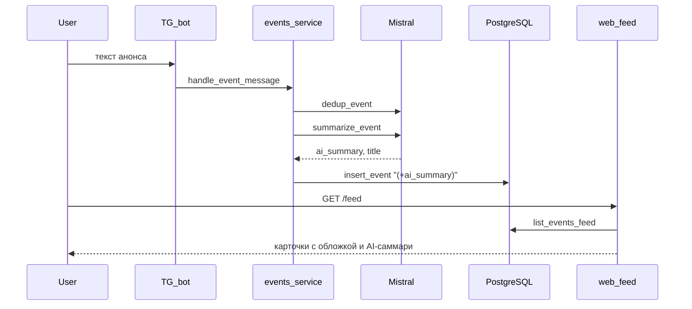

# Редизайн сайта: тёмная премиум-тема + умные блоки

## Стиль (одна дизайн-система на всё)

- **Палитра**: фон `#0a0d14`, поверхность `#11151f`, поверхность-2 `#161b27`, граница `#1f2535`, текст `#e6e8ef`, муть `#7d8597`, акцент `#8a9bff` (приглушённый индиго), второй акцент `#c084fc`. Тонкие свечения вместо ярких заливок.
- **Типографика**: Inter (Google Fonts, через `<link>`), tabular-nums для чисел; крупные заголовки `clamp(1.6rem, 3vw, 2.4rem)`, регулярный 0.95rem.
- **CSS-фреймворк**: **Tailwind CSS через Play CDN** (`<script src="https://cdn.tailwindcss.com">` + inline `tailwind.config = {...}` с нашей палитрой). Нулевая сборка, минимум сложности, как просит проект (см. правила «простота > абстракции»). Кастомные мелочи остаются в [web/static/css/base.css](web/static/css/base.css).
- **Иконки**: набор inline SVG в [web/templates/_icons.html](web/templates/_icons.html) (Lucide-стиль: folder, file, file-text, image, calendar, clock, users, github, log-out, search). Никаких внешних иконочных шрифтов.

## Что меняется на каждой странице

### Логин ([web/templates/login.html](web/templates/login.html))
- Центрированная карточка на фоне с двумя радиальными размытыми пятнами (CSS, без картинок).
- Шаг 1: крупное поле UID, кнопка «Далее» с лёгким glow при hover. Шаг 2: 6 разрозненных боксов под цифры (одно поле + CSS-разметка), автофокус, autocomplete `one-time-code`.

### Layout / навигация ([web/templates/base.html](web/templates/base.html))
- Слева тонкий sidebar (на мобильном — top-nav, переключаем по `md:` breakpoints): иконка + подпись. Активный пункт подсвечен полоской слева.
- В шапке справа — текущий UID (мелко) и кнопка «Выйти» с иконкой.

### Библиотека ([web/templates/library.html](web/templates/library.html)) — главная переделка
- Два режима в **одном URL** через query-параметр `?cat=<slug>`:
  1. Без `cat` — **сетка папок**: каждая папка = карточка с SVG-иконкой папки, названием категории и счётчиком в скобках (`Алгоритмы (12)`). Hover — лёгкий подъём + бордер на акцент.
  2. С `cat` — **внутри папки**: хлебные крошки `Файлы / <категория>`, слева список файлов (иконка по mime: PDF/изображение/файл, имя, автор, дата), справа просмотрщик (PDF — iframe, картинка — ``, иное — большая иконка + кнопка «Скачать»).
- Счётчики берём через новый запрос `repo.list_categories_with_counts(pool)` — один SQL `SELECT slug, label_ru, COUNT(files.*) ... GROUP BY ...`. Спрятать категории с 0 файлов из режима «папки», но из выпадающего списка не убирать.
- Активный файл подсвечивается; URL `/library?cat=ml&file=42` для копируемых ссылок (минимальный JS читает/пишет query).

### Мероприятия ([web/templates/feed.html](web/templates/feed.html))
- **Сетка карточек 1 / 2 колонки** (по ширине). Каждая карточка:
  - Сверху декоративный «cover»-блок высотой ~120px: CSS-градиент, цвет которого выводится из стабильного хеша названия (см. ниже).
  - Заголовок (`normalized_title` или AI-саммари-заголовок).
  - **AI-саммари** в 1–2 строки (новое поле в БД).
  - Бейджи: `Скоро` (если `ends_at` ≤ 7 дней), `Новое` (created ≤ 48 ч), `До <дата>` (если `ends_at`). Фон бейджа — полупрозрачный акцент.
  - Кнопка «Подробнее» — раскрывает полный `raw_text` через `<details>` без JS.
- **Градиент обложки**: в Jinja-фильтре `event_gradient(title)` — детерминированный hash → один из 6 готовых наборов из 2 цветов (palette в [web/static/css/base.css](web/static/css/base.css), классы `.cover-1` … `.cover-6`).

### Сегодня ([web/templates/today.html](web/templates/today.html))
- Не «таблетки», а **компактные строки** в сетке: маленький цветной квадрат-обложка (тот же градиент), заголовок, рядом справа дедлайн или метка «новое». Высота строки ~56px, фокус на сканировании списка.
- Сверху мини-метрика: `5 актуальных` / `2 заканчиваются на этой неделе`.

### Люди ([web/templates/people.html](web/templates/people.html), [web/templates/person.html](web/templates/person.html))
- Сетка карточек: круглый аватар (если фото есть — оно; если нет — инициал на градиенте), имя, обрезанное bio, GitHub-кнопка с иконкой.
- Страница профиля: hero с фото слева и био+GitHub справа, ниже галерея фото (если их больше одного).

### Свой профиль ([web/templates/profile_edit.html](web/templates/profile_edit.html))
- Двухколоночная форма: слева превью текущего профиля (как его увидят другие), справа поля. Drag-n-drop зона для фото с превью миниатюр и крестиком (минимальный JS).

## Бэкенд: AI-саммари мероприятий

- **БД**: миграция 6 в [db/schema_patch.py](db/schema_patch.py) и обновление [db/schema.sql](db/schema.sql):
  - `ALTER TABLE events ADD COLUMN ai_summary TEXT;`
- **Промпт**: [prompts/event_summary.txt](prompts/event_summary.txt) — «верни JSON `{summary: <≤140 симв.>, title: <≤60 симв.>}` на русском, без воды, без эмодзи».
- **Сервис**: новая функция в [services/llm.py](services/llm.py) — `summarize_event(pool, raw_text)` по образцу `summarize_file`.
- **Создание события**: в [services/events_service.py](services/events_service.py) сразу после `insert_event` вызвать `summarize_event` и записать `ai_summary` (новый `repo.update_event_summary`). При ошибке Mistral — оставить NULL, на сайте красиво деградируем.
- **Бэкфилл старых**: одноразовый скрипт [web/backfill_summaries.py](web/backfill_summaries.py) — пробегает по `events WHERE ai_summary IS NULL AND status='published'`, мягкий лимит и `await asyncio.sleep(0.5)` между вызовами. Запуск: `docker compose exec web python -m web.backfill_summaries`.
- **Фронт**: показываем `ai_summary` если он есть; иначе — первая строка `raw_text` обрезанная по слову.

## Фолбэк-обложка по названию

```
def event_gradient_class(title: str) -> str:
    h = hashlib.md5(title.encode("utf-8")).digest()[0]
    return f"cover-{h % 6 + 1}"
```

В CSS — 6 классов с парами вроде `linear-gradient(135deg, #4f46e5 0%, #c084fc 100%)`, оверлей `radial-gradient` с шумом-альфой.

## Зависимости и инфра

- **Внешний CDN**: Tailwind Play CDN, шрифт Inter — оба через `<link>` / `<script>`. Не требуют ничего в `pyproject.toml`. Если нужен оффлайн — отдельная задача (CDN-подход проще, держим MVP).
- **Иконки**: inline SVG, без зависимостей.
- Никаких новых Python-зависимостей: всё уже есть (`httpx`, `fastapi`, `jinja2`).
- Изменения в [web/static/css/base.css](web/static/css/base.css) — переписываем под новую систему; в шаблонах основной набор Tailwind-классов.

## Поток одного события (диаграмма)



## Что улучшать позже (не делаем сейчас)

- Извлечение `starts_at`/`ends_at` из текста LLM — нужны промпт и мерджинг с дедупом.
- Картинки из forward-сообщений в боте → обложки событий: требует обработки `msg.photo` в боте, отдельной таблицы и API раздачи; пользователь предпочёл цветной блок.
- Светлая тема — переключатель темы на CSS variables; тёмная сейчас единственная.