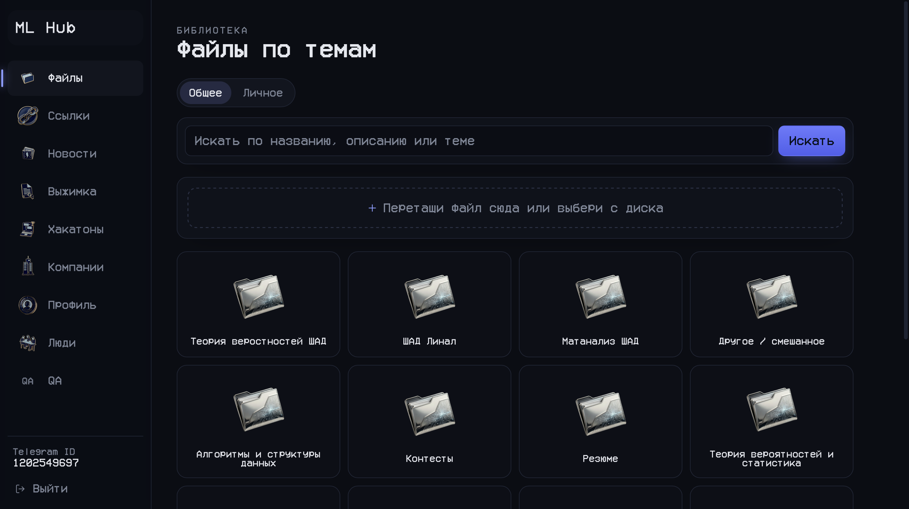
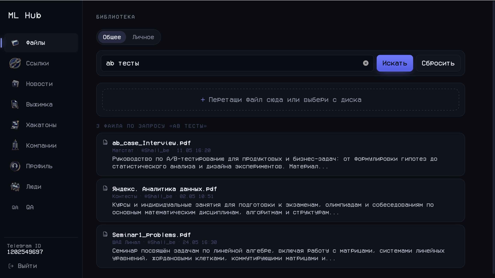
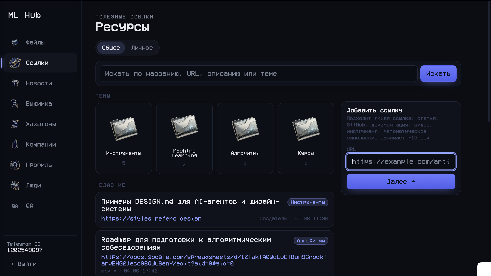
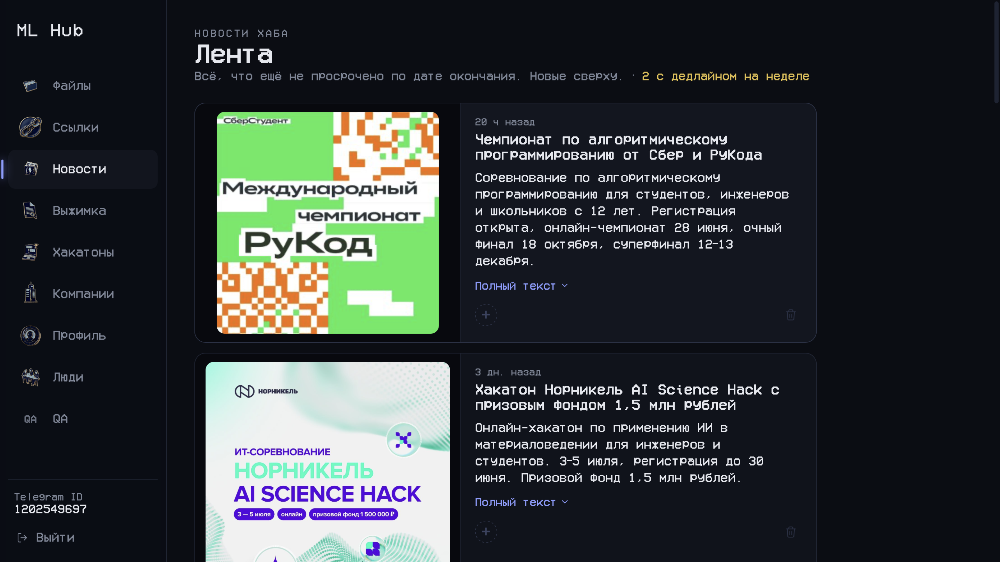
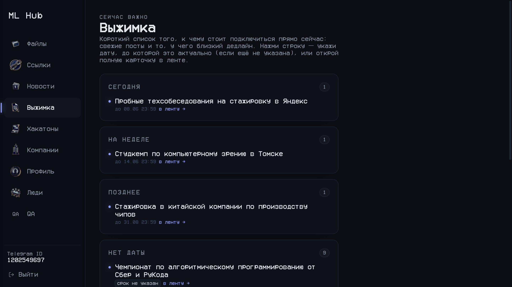
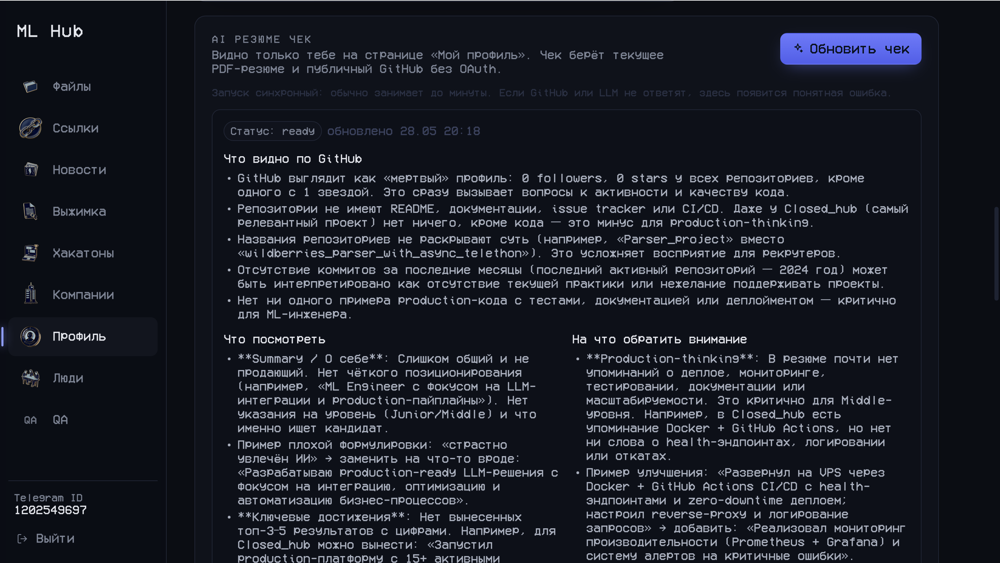
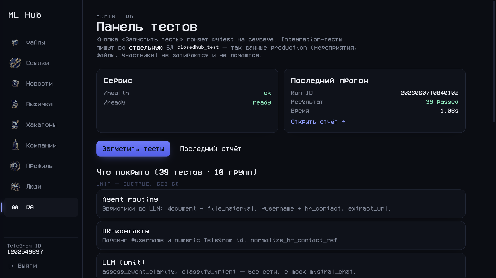
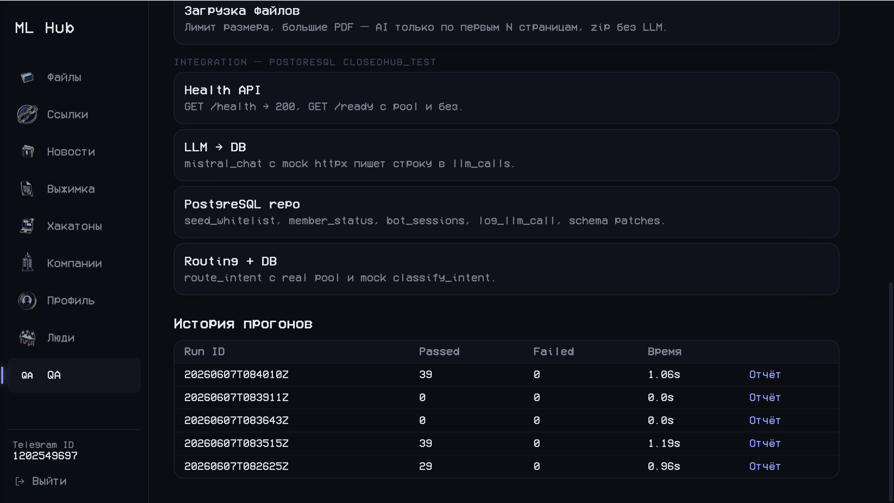

# Closed Hub

Закрытая платформа ML-сообщества: **Telegram-бот** собирает мероприятия, HR-контакты и материалы; **FastAPI-веб** показывает ленту, компании, библиотеку и профили. **Mistral LLM** маршрутизирует intent, саммаризирует новости и извлекает HR-контекст. Данные — **PostgreSQL** (asyncpg, pgvector).

**Live demo:** [hub-ml.ru](https://hub-ml.ru) · **Репо:** https://github.com/NeverLucky-DS/Closed_hub

| Навык | Реализация |
|-------|------------|
| Python | `bot/`, `web/`, 20+ модулей в `services/` |
| FastAPI | REST + HTML (Jinja2), `/health`, `/ready`, auth API |
| PostgreSQL | asyncpg, pgvector, `db/repo.py`, schema patches |
| Тесты | pytest — **22** теста (`tests/`), без внешних API |
| LLM / агенты | `services/routing.py` → `services/llm.py`, промпты в `prompts/` |
| Async | asyncpg, httpx, `asyncio.Queue` worker, debounced HR extract |
| Docker | docker-compose: Postgres + bot + web |
| Git | GitHub Actions (import smoke + pytest) |

**Поток данных:** Telegram → handlers → routing (heuristic + LLM) → services → PostgreSQL; веб читает те же данные.

---

## Демонстрация

### Библиотека файлов

Тематические папки, drag-and-drop загрузка PDF, разделение «Общее» / «Личное».



Поиск по названию, описанию и теме; карточки с категорией и автором.



### Полезные ссылки

Темы, недавние ресурсы, добавление URL с автозаполнением через LLM (~15 сек).



### Лента и выжимка

AI-саммари мероприятий из Telegram-бота; дедлайны, фильтр по актуальности.





### Профиль и AI-анализ

Приватный разбор PDF-резюме и публичного GitHub без OAuth.



### QA-панель (web-admin)

Запуск pytest на сервере, health/ready, unit + integration с отдельной БД `closedhub_test`.





**Live:** [hub-ml.ru](https://hub-ml.ru)

---

## Быстрый старт

```bash
cp .env.example .env   # TELEGRAM_BOT_TOKEN, MISTRAL_API_KEY, WEB_SESSION_SECRET
docker compose up -d   # Postgres :5433, web http://localhost:8001
```

Локально без Docker:

```bash
uv sync
uv run python -m bot.main    # Telegram-бот
uv run python -m web.main    # веб на :8000
```

Переменные — в [`.env.example`](.env.example).

---

## Архитектура

```
Telegram → bot/handlers → routing (heuristic + LLM) → services → PostgreSQL
                              ↓
                         prompts/ + Mistral API
                              ↓
FastAPI web ← asyncpg pool ← те же таблицы (лента, компании, файлы)
```

| Путь | Назначение |
|------|------------|
| `bot/` | Telegram bot, handlers |
| `web/` | FastAPI, templates, static |
| `db/` | asyncpg pool, repo, schema.sql |
| `services/` | LLM, routing, events, files, HR, search |
| `prompts/` | промпты Mistral (отдельно от кода) |
| `docs/changelog/` | история изменений |

---

## Тесты

```bash
uv sync
uv run pytest -v
```

Покрыто: agent router (`heuristic_route`, `route_intent` с mock LLM), парсинг HR-контактов, `GET /health` и `GET /ready`. Внешние API (Mistral, Telegram) не вызываются.

---

## Production / VPS

- Deploy: [`deploy/README.md`](deploy/README.md)
- Health: `GET /health`, `GET /ready`

Секреты не коммитить: `.env`, `storage/`.
